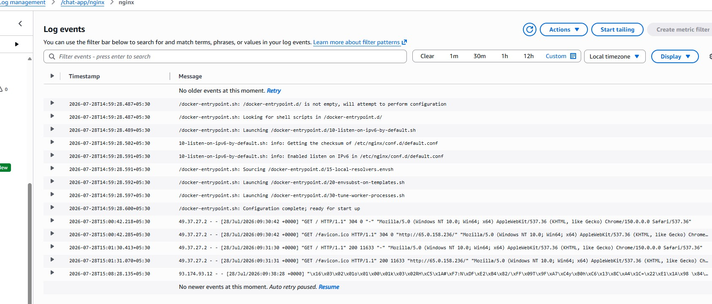
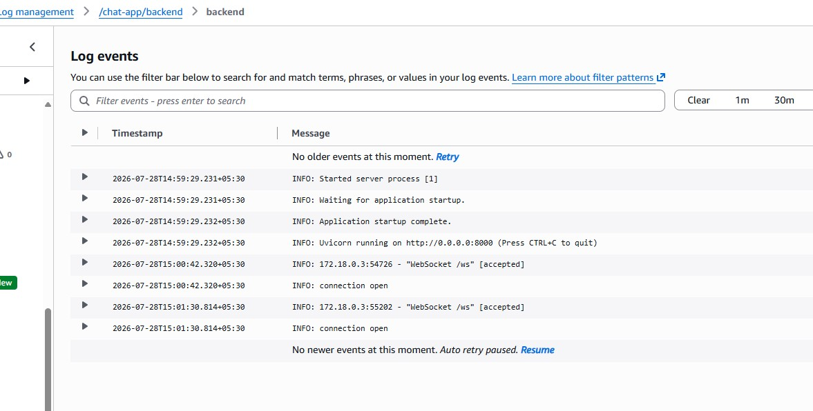
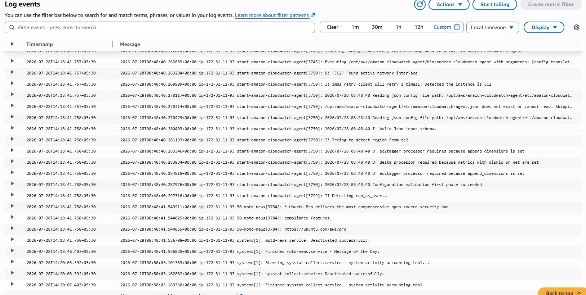

# Real-Time Chat App — Docker + Nginx + CI/CD Deployment

**Live app:** http://65.0.158.236

---

## 1. What this actually is

A single-page chat client talks to a FastAPI backend over a WebSocket connection. Nginx sits in front of both, acting as the only thing the internet ever touches, it serves the static frontend directly and reverse-proxies WebSocket traffic back to the backend. Everything runs in Docker, on a single EC2 instance, deployed automatically via GitHub Actions whenever code is pushed to `main`.

Three containers, one Elastic IP, one pipeline.

---

## 2. Architecture

```
                              Internet
                                 |
                      [ AWS Internet Gateway ]
                                 |
                                 ▼
 ┌────────────────────────────────────────────────────────┐
 │        EC2 t3.micro — Elastic IP 65.0.158.236           │
 │  ┌────────────────────────────────────────────────┐    │
 │  │              Docker Compose network              │    │
 │  │                                                    │    │
 │  │                              port 80 (PUBLIC)     │    │
 │  │   ┌───────────────┐                               │    │
 │  │   │  chat-nginx    │◄──────────────────────────────┼────┼──── Internet
 │  │   │ (reverse proxy)│                               │    │
 │  │   └───────┬────────┘                               │    │
 │  │           |                                        │    │
 │  │     ┌─────┴─────┐                                  │    │
 │  │     ▼           ▼                                  │    │
 │  │  GET /  →   GET/WS /ws  →                           │    │
 │  │  serves static  proxies to backend                  │    │
 │  │  frontend files (with upgrade headers)               │    │
 │  │                   |                                  │    │
 │  │                   ▼                                  │    │
 │  │   ┌────────────────┐   port 8000                     │    │
 │  │   │  chat-backend   │  (internal only,                │    │
 │  │   │ FastAPI + uvicorn│   `expose`, no                  │    │
 │  │   └────────┬────────┘   public mapping)                │    │
 │  │            :  (not wired into app code yet)            │    │
 │  │            ▼                                            │    │
 │  │   ┌────────────────┐   port 6379                        │    │
 │  │   │   chat-redis    │  (internal only,                    │    │
 │  │   │ provisioned only│   see Bonus section)                │    │
 │  │   └─────────────────┘                                     │    │
 │  └────────────────────────────────────────────────────────┘    │
 └──────────────────────────────────────────────────────────────┘
```

**Reading this diagram:** The browser only ever knows about one address, the Elastic IP. Everything past the Internet Gateway happens inside a single EC2 instance, and `chat-nginx` is the only container that's actually reachable from outside it. `chat-backend` and `chat-redis` are drawn *inside* the same box on purpose, they exist only on the internal Docker network and have no path to the public internet at all.

Nginx is the only container with a published port (`80:80`). The backend and Redis both use `expose` rather than `ports`, so they're reachable from other containers on the Docker network but have zero exposure to the outside world, even if someone scanned every port on the public IP, they'd only ever find port 80 open (and port 22 for SSH, locked to my own IP in the security group).

---

## 3. How the Docker containers are set up

There are three services defined in `docker-compose.yml`, and each one has a different job:

**`chat-backend`** - Built from the local `Dockerfile`. Starts from `python:3.11-slim`, installs the dependencies in `requirements.txt`, copies in `main.py`, and runs it with uvicorn. This is the only container that's actually built from source here, the other two just use ready-made images off the shelf. It doesn't publish a port to the host it only `expose`s port 8000, meaning other containers can reach it, nothing outside Docker can.

**`chat-nginx`** - Uses the official `nginx:alpine` image straight from Docker Hub, no custom build needed. Two things get mounted into it as volumes: the `frontend/` folder (so it has the actual HTML/CSS/JS to serve) and `nginx.conf` (so it knows how to route requests). This is the only container that publishes a port to the outside world `80:80`.

**`chat-redis`** - Also a stock image (`redis:alpine`), no custom config. Currently just running, not yet used by the app (see the Bonus section for why).

All three are set to `restart: always`, which means Docker will bring a container back up automatically if it crashes, if it's stopped, or if the whole EC2 instance reboots, you don't need to SSH in and manually start anything after a restart.

To bring the whole stack up: `docker compose up -d --build` this builds the backend image fresh, pulls the other two if they're not already local, creates a shared network for all three, and starts them in the background.

---

## 4. Docker networking, in plain terms

Here's the simplest way to think about it: Docker Compose automatically puts all three containers on their own private network the moment you run `docker compose up`, and it gives every container a nickname on that network, its **service name**. Nothing extra to configure, it just happens.

That nickname is exactly what the containers use to find each other. Inside `nginx.conf`, the line that forwards WebSocket traffic just says `proxy_pass http://backend:8000/ws;` Nginx doesn't know or care what `backend`'s actual internal IP address is, it just asks Docker "where's the thing called `backend`?" and Docker answers. It's the same idea as how your laptop can reach `google.com` without you knowing Google's actual server IP.

The one gotcha worth knowing: **that internal IP can change.** It happened during this project, I rebuilt the `chat-backend` container after adding Redis, and it came back up with a new internal IP, as containers normally do on rebuild. `chat-nginx`, which had been running the whole time and hadn't been restarted, kept trying to reach the *old* IP it had already resolved, and started throwing connection-refused errors even though the backend itself was perfectly healthy. Restarting Nginx fixed it instantly, because that forced it to look up `backend`'s name again and get the current answer.

**Takeaway:** if you rebuild one container in a multi-container app, restart the ones that depend on it too or just rebuild the whole stack together with a plain `docker compose up -d --build`, without pointing it at a single service.

---

## 5. The bugs: What was actually broken

The repo came with four separate issues spread across the Dockerfile, docker-compose.yml, and nginx.conf. None of them were backend bugs, the FastAPI code was correct the whole time, which matched what the assignment said. Here's what I found, in the order I found them.

### Bug 1 - Backend only listening on `127.0.0.1`

```dockerfile
CMD ["uvicorn", "main:app", "--host", "127.0.0.1", "--port", "8000"]
```

Uvicorn was bound to loopback, which inside a container means "reachable only from within this exact container." Nginx, running in a separate container, had no way to reach it not because of a networking misconfiguration, but because the backend was never listening on an interface anything else could see. Confirmed this directly from the logs (`Uvicorn running on http://127.0.0.1:8000`) before touching anything.

**Fix:** changed the bind address to `0.0.0.0`, which listens on all interfaces, including the internal Docker network interface.

### Bug 2 - Frontend volume mount was commented out

```yaml
volumes:
  # - ./frontend:/usr/share/nginx/html:ro
  - ./nginx.conf:/etc/nginx/nginx.conf:ro
```

With that line commented out, nothing was ever mounted into Nginx's web root, so it just served its own default "Welcome to nginx!" page. Reproduced this by hitting the site in a browser before fixing anything confirmed exactly the symptom you'd expect.

**Fix:** uncommented the volume mount.

### Bug 3 — Nginx proxying to itself instead of the backend

```nginx
proxy_pass http://localhost:8000/ws;
```

Inside the `nginx` container, `localhost` refers to Nginx itself, not the backend container. There was nothing listening on port 8000 inside the Nginx container, so every WebSocket request failed with a connection refused error.

**Fix:** changed the target to the Docker Compose service name — `http://backend:8000/ws` which Docker's internal DNS resolves to the actual backend container.

### Bug 4 — Missing WebSocket upgrade headers

```nginx
# proxy_set_header Upgrade $http_upgrade;
# proxy_set_header Connection "upgrade";
```

A WebSocket connection starts life as a normal HTTP request carrying an `Upgrade: websocket` header, asking the server to switch the connection from HTTP to the WebSocket protocol. Nginx doesn't forward that header to the upstream by default you have to tell it to. Without these two lines, Nginx was proxying the request as plain HTTP, the backend's WebSocket handler never saw the upgrade request, and the handshake just failed.

**Fix:** uncommented both headers.

### How I verified all four were actually fixed

Rebuilt, opened the browser console, confirmed the WebSocket handshake returned a `101 Switching Protocols`, then opened a second tab in incognito and sent messages back and forth to confirm multi-user broadcast actually worked not just that the page loaded.

---

## 6. Nginx reverse proxy, and how WebSockets get through it

**What a reverse proxy actually is, quickly:** normally when you visit a website, your browser talks directly to whatever server is running that site. A reverse proxy sits in between the browser only ever talks to the proxy, and the proxy quietly decides what to do with the request behind the scenes. The browser has no idea there's anything else back there at all. It's called "reverse" because a regular proxy hides the *client* from the server; this does the opposite it hides the *server* from the client.

**How that's used here:** Nginx is that proxy. It's the only container the internet can actually reach, and it looks at the *path* of every incoming request to decide what to do with it:

- **`/`** — Nginx just hands back the static frontend files directly (`frontend/index.html` and friends). It doesn't even involve the backend for this it's just a file server for this path.
- **`/ws`** — Nginx doesn't answer this itself. It quietly forwards the request over to `chat-backend`, waits for the response, and relays it back to the browser. The browser never learns that a separate backend container even exists as far as it's concerned, it's talking to one server the whole time.

**How WebSockets specifically get through it:** A WebSocket connection doesn't start out as a WebSocket it starts as a completely normal HTTP request, just with a couple of special headers attached that say, in effect, "hey, can we switch this connection over to WebSocket instead of regular HTTP?" If the server agrees, both sides just keep the same connection open and start speaking WebSocket over it instead no more back and forth request/response, just an open pipe both sides can push messages through whenever they want.

The catch is that Nginx doesn't forward those special "please upgrade me" headers by default, you have to explicitly tell it to:
```nginx
proxy_set_header Upgrade $http_upgrade;
proxy_set_header Connection "upgrade";
```
Without these two lines, Nginx quietly treats the WebSocket request as if it were a normal, boring HTTP request, the backend never gets asked to upgrade the connection, and the WebSocket handshake just fails this was exactly Bug 4 above, and exactly what these two lines fix.

**Why can't we just let the browser talk to the backend directly?** Because this way, the backend is never exposed to the internet at all only Nginx is. Even if there were a security hole in the Python code, nobody outside the Docker network could ever reach it to exploit it. Nginx is the only thing with a public face, everything else stays hidden behind it.

---

## 7. CI/CD Pipeline

**How it works for this project:** every time code gets pushed to `main` on GitHub, a workflow defined in `.github/workflows/deploy.yml` kicks off automatically. It uses an action called `appleboy/ssh-action` to SSH into the EC2 instance, `cd` into the project folder, pull the latest code, and rebuild the containers the exact same three commands I'd otherwise be typing manually over SSH every time something changed:

```yaml
script: |
  cd /home/ubuntu/SpotSure-realtime-chat-deployment
  git pull origin main
  docker compose up -d --build
```

The server's address, SSH username, and private key are stored as encrypted GitHub Actions secrets rather than sitting in the workflow file, GitHub injects them at runtime, they're never visible in any log or in the repo itself.

**The debugging story worth telling here:** the first run of this pipeline failed with `permission denied while trying to connect to the docker API`. This was confusing at first because Docker worked fine when I SSHed in manually. It turned out that earlier, when setting up Docker on the instance, I'd hit the same permission error interactively and worked around it with `sudo newgrp docker` which effectively dropped me into a root-privileged session rather than actually fixing the `ubuntu` user's group membership. Everything I did afterward worked because I was implicitly running as a privileged user, not because the fix had actually taken effect for a normal login.

GitHub Actions' SSH action does a genuinely clean login every time no inherited shell state, no `sudo` shortcuts, which is exactly what exposed that the underlying fix had never really landed. The real fix was logging out of the SSH session entirely, reconnecting fresh, and confirming `docker ps` worked as the plain `ubuntu` user with no `sudo` anywhere in the chain. Once that was actually true, the pipeline worked on the very next run.

Worth remembering: a `sudo` workaround can make a permissions problem *look* solved without actually solving it, and the cleanest way to know for sure is to test under the same conditions the automation will actually run under.

---

## 8. Deployment steps

**Local:**
```bash
git clone https://github.com/KumarSwarnim19/SpotSure-realtime-chat-deployment.git
cd SpotSure-realtime-chat-deployment
docker compose up -d --build
```
App available at `http://localhost`.

**Cloud — live right now:**

App Available at **http://65.0.158.236**

Steps taken to get there (documented for reproducibility):
1. EC2 t3.micro, Ubuntu 24.04, 20GB gp3
2. Elastic IP allocated and associated (so the public IP survives instance restarts)
3. Security group: SSH (22) restricted to my IP, HTTP (80) open to `0.0.0.0/0`
4. IAM role attached with `CloudWatchAgentServerPolicy` for monitoring
5. Docker installed, `ubuntu` user added to the `docker` group
6. Repo cloned, `docker compose up -d --build`
7. GitHub Actions secrets configured (`EC2_HOST`, `EC2_USERNAME`, `EC2_SSH_KEY`)
8. From that point on, every push to `main` deploys itself

---

## 9. Bonus work

### CloudWatch Monitoring: Implemented

Went further than basic EC2 metrics here, since those don't include memory or disk usage by default.

- **System metrics** via the CloudWatch Agent: CPU (idle/user/system/iowait breakdown), memory usage, disk usage, swap all at 60s resolution, tagged with instance dimensions.
- **System logs**: `/var/log/syslog` shipped to CloudWatch Logs, 7-day retention (kept short deliberately this is a demo project, not a system with a real compliance retention requirement).
- **Container-level application logs**: both `chat-nginx` and `chat-backend` use Docker's `awslogs` logging driver, shipping straight to CloudWatch instead of sitting in local `json-file` logs. This is the part that actually answers "can you see users connecting" the backend log stream shows real connection events (`WebSocket /ws [accepted]`, `connection open`) with timestamps, and the Nginx stream shows every request including the WebSocket upgrade requests and status codes.

An unexpected but genuinely useful side effect of turning this on: the Nginx logs also picked up raw TLS handshake bytes hitting port 80 from random IPs background internet scanning traffic that's constantly probing public IPs. Not an incident, just normal internet noise, but it's the kind of thing you only get visibility into once you're actually shipping logs somewhere.

An IAM role with `CloudWatchAgentServerPolicy` is attached to the instance so the agent (and Docker's logging driver) can actually push data to CloudWatch this is granted at the instance level, not via long-lived credentials on disk.

**Screenshots from CloudWatch Logs Insights:**

**1. `chat-nginx` container logs** The request-level traffic hitting the app. Shows the Nginx entrypoint config steps on container start, followed by real incoming requests (`GET /`, `GET /favicon.ico`) with status codes, and further down the raw scanning traffic mentioned above showing up as garbled bytes instead of a clean HTTP request.



**2. `chat-backend` container logs** The application-level view, showing uvicorn starting up on `0.0.0.0:8000`, followed by the actual WebSocket events that prove the chat is working: `WebSocket /ws [accepted]` and `connection open` each time a client connects.



**3. EC2 system logs (`/var/log/syslog` via the CloudWatch Agent)** This is the instance-level log stream, separate from the two above. It shows the CloudWatch Agent itself starting up on boot: detecting it's running on EC2, reading its config, and validating it before it starts shipping metrics and logs.



### Redis: Provisioned, intentionally not wired in

Added a `redis:alpine` container to `docker-compose.yml`, internal-only (same principle as the backend never touches the internet).

Right now there's just one backend, and it keeps track of connected users purely in its own memory, which works fine at this size. The moment you run more than one backend instance, that breaks a user on instance A wouldn't see a message sent by someone on instance B, since neither instance knows the other exists. Redis fixes this, every instance publishes messages to it and listens to it, so a message from anyone reaches everyone, no matter which instance they're connected to.

I didn't actually wire this into `main.py`, since that would mean touching the backend's message-broadcasting code and the assignment was clear that backend code was off-limits. So this is here as the groundwork for later, not a working feature yet. Didn't add `redis` to `requirements.txt` either, since nothing's using it.

### Load balancer architecture: How it would work for this project

Right now there's one Nginx + one backend on one EC2 instance. If I needed to handle more traffic, I'd put an **AWS Application Load Balancer** in front of multiple copies of this same setup each running its own Nginx + backend, all behind the one load balancer, so users just hit one address and the ALB decides which instance actually handles them.

A few things I'd need to keep in mind specifically for this app:

- **Sticky sessions have to be turned on.** WebSocket connections stay open for a long time, so once a user connects to an instance, all their traffic needs to keep going to that same one otherwise the ALB could bounce them mid-conversation and break the connection.
- **Instances still need to talk to each other.** Sticky sessions mean two chatting users could land on two different instances. This is exactly what Redis (already provisioned here) would solve every instance publishes and subscribes to the same channel, so a message reaches everyone regardless of which instance they're on.
- **Health checks shouldn't hit `/ws`.** The ALB needs to know an instance is healthy, but a plain check on `/` is better than pinging the WebSocket path, so it doesn't interfere with real connections.

### Auto-scaling approach: My approach for this project

If this chat app needed to handle more users than one EC2 instance could comfortably manage, here's specifically what I'd do: put the current instance's setup — Ubuntu, Docker pre-installed, the security group, the IAM role into a **launch template**, then put that behind an **Auto Scaling Group**. That way, instead of me manually launching a second EC2 instance and setting it up by hand the way I did this one, AWS just spins up identical copies on its own whenever they're needed.

For the trigger, I'd reuse the CloudWatch metrics that are already flowing in no new setup needed there. Something like if average CPU across instances stays above 70% for 5 minutes, launch another instance; if it drops back down, remove one.

The one thing I'd be careful about, specific to this app, is scaling *down*. A normal website request finishes in milliseconds, so removing a server never really affects anyone. This app's WebSocket connections stay open for as long as someone has the chat page open, if an instance got killed abruptly during scale-down, everyone currently chatting on it would just get disconnected. So I'd make sure **connection draining** is turned on, the instance stops accepting new users but lets everyone already connected finish naturally before it actually shuts down.
